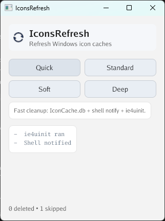

# IconsRefresh

Refresh Windows icon caches for Desktop, Start Menu, and Taskbar.

## Project Status

This project is being revived and cleaned up in 2026.

## Compatibility

- OS: Windows 11
- CPU: x64 / amd64
- Release binaries target `windows/amd64`
- Windows 11 ARM64 is not natively supported (works only with x64 emulation)

## Binaries

- `IconsRefresh.exe`: command-line tool
- `IconsRefreshUI.exe`: interactive desktop UI

## UI Screenshot



## Download

- Latest release: [Download here](../../releases/latest)
- All releases: [Release list](../../releases)
- Release files: `IconsRefresh.exe`, `IconsRefreshUI.exe`, `checksums.txt`

### Publishing a release (maintainers)

Pushing a tag like `v0.1.0` triggers GitHub Actions to:

- build `IconsRefresh.exe` and `IconsRefreshUI.exe`
- generate `checksums.txt`
- create a GitHub Release and upload these files

Example:

```powershell
git tag v0.1.0
git push origin v0.1.0
```

## Getting Started

If you only want to use the app, download binaries from Releases.
Build from source if you want to develop or modify it.

### Prerequisites

- Go `1.23.8+`
- Mage build tool

If your local Go version is older, Go may auto-download the required toolchain.

Install Mage:

```powershell
go install github.com/magefile/mage@latest
```

Ensure your Go bin folder is in `PATH` (usually `%USERPROFILE%\\go\\bin`).

### Build

```powershell
go mod download
mage build
```

Output binaries:

- `bin\\IconsRefresh.exe`
- `bin\\IconsRefreshUI.exe`

If `mage` is not in your `PATH`, run:

```powershell
go run github.com/magefile/mage build
```

## Usage

### CLI

```text
IconsRefresh.exe [--dry-run] [--json] <quick|soft|standard|deep>
```

Flags:

- `--dry-run`: print planned actions without deleting cache files
- `--json`: emit machine-readable output

### UI

```text
IconsRefreshUI.exe
```

The UI is interactive and does not accept mode flags.
It offers `Quick`, `Standard`, and `Deep` buttons. `soft` is CLI-only.

## Modes

| Mode | ie4uinit | Shell notify | IconCache.db | Explorer iconcache_*.db | AppIconCache |
|------|----------|--------------|--------------|-------------------------|--------------|
| `quick` | Yes | Yes | Yes | No | No |
| `soft` | No | Yes | Yes | No | No |
| `standard` | Yes | Yes | Yes | Yes | No |
| `deep` | Yes | Yes | Yes | Yes | Yes |

## Windows Cache Targets

- `%LocalAppData%\\IconCache.db`
- `%LocalAppData%\\Microsoft\\Windows\\Explorer\\iconcache_*.db`
- `%LocalAppData%\\Packages\\Microsoft.Windows.Search_*\\LocalState\\AppIconCache`

## Development

Run tests:

```powershell
go test ./...
```

## License

MIT. See `LICENSE` for details.  
Icon credit: Oliver Scholtz.
